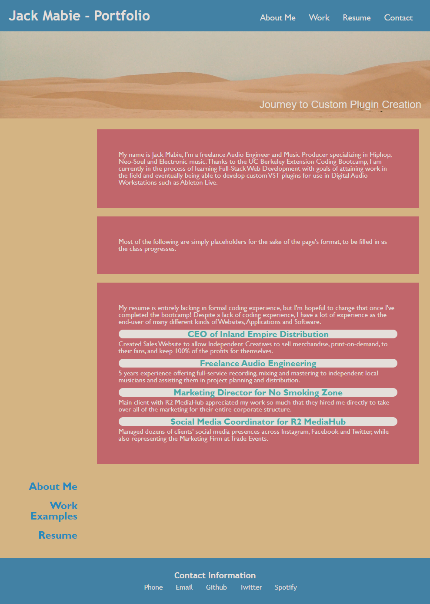

# 02 Advanced CSS: Portfolio - John Mabie

Was not able to beginning this Challenge as soon as I would have liked and have run into some technical issues getting the formatting correct and matching the sample provided. 

Uploading a partially finished version of the repo to GitHub in order to submit the assignment on time and will be updating until it fully meets the Challenge grading requirements. 

A screenshot of how the HTML index was showing in Google Chrome can be found at the following location:

A link to the deployed application (partially complete) can be found below:
https://jmabie94.github.io/12-15-22-Homework-Challenge/