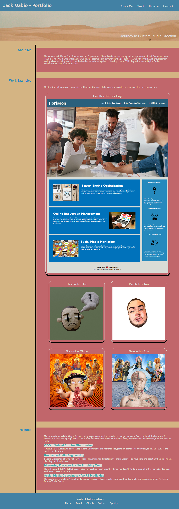
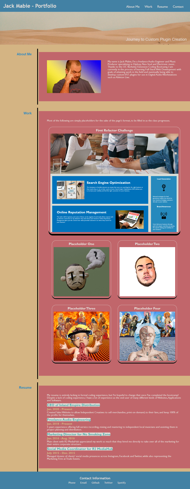

# 02 Advanced CSS: Portfolio - John Mabie

Was not able to beginning this Challenge as soon as I would have liked and have run into some technical issues getting the formatting correct and matching the sample provided. 

Uploading a partially finished version of the repo to GitHub in order to submit the assignment on time and will be updating until it fully meets the Challenge grading requirements.

UPDATE: after some assistance in office hours, the application is much *more* complete, but still will need tweaking in the coming days to perfect. New screenshot attached to the README.

UPDATE 2: made adjustments on 12/19/22 to improve some detail work on the application, added a new photo to the README for compare/contrast with the original.

A screenshot of how the HTML index was showing in Google Chrome can be found at the following location:

A screenshot of how the HTML index was showing in Google Chrome after 12/19/22 update can be found at the following location:

Updated: 2/1/23 with the First Group Project added!

A link to the deployed application (partially complete) can be found below:
https://jmabie94.github.io/12-15-22-Homework-Challenge/